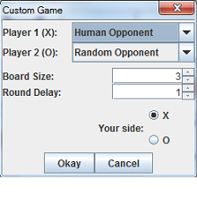
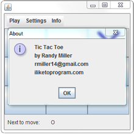
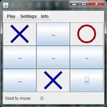
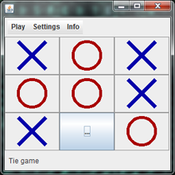
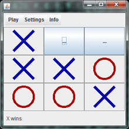

# Tic Tac Toe #

## Summary ##

A fully customizable tic tac toe application in Java with three AI players, support for human players, and support for larger boards as well.

## Description ##

This was my first fully-fleshed out game I did on my own. It's a Java application that can also be embedded in web sites as an applet (this host doesn't allow embedding applets). 

I tried out different implementations of AI, and I ended up keeping three:
 - Random AI: picks a spot randomly
 - Strategic AI: picks a spot according to a (partial) [set of hard-coded directives](http://www.chessandpoker.com/tic_tac_toe_strategy.html)
 - Minimax AI: picks a spot according to the minimax algorithm

The board's internal representation is loosely based on [Harvard CS 51's](https://canvas.harvard.edu/courses/7591/) pset (Checkers), but everything else was designed by me (including the amazing graphics). 

How to run the application:
 - Make sure you have Java installed. If you don't, [follow these instructions](http://www.wikihow.com/Install-Java).
 - Download one of the releases below (most recent is first).
 - Unzip the .rar file and navigate into the unzipped folder.
 - Double click the .jar file to start up the application

## Documentation ##

Formal documentation around the classes is stored in the doc folder and can be viewed online [here](https://iliketoprogram14.github.io/TicTacToeApplication/).

## Screenshots ##

#### Custom game ####

#### About window ####

#### Playing example ####

#### Tie game ####

#### X wins ####

